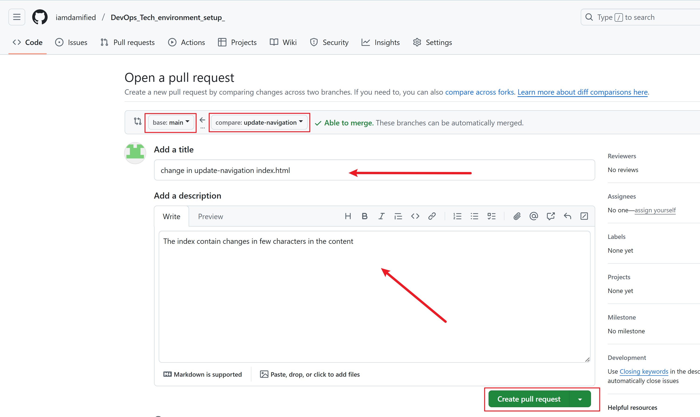

# Git Branching and Merging

## Github Repository: cd Version_control_sys

- Main Branch

## Switching to update-navigation branch: git checkout update-navigation

- Click on main branch and select update-navigation branch on Github

## Started New Pull Request: git pull origin main

- pull and make changes in the files, then use the following commands.

git add index.html

git commit -m "changed few characters"

## Created New Pull Request: git push origin update-navigation

- Click Contribute, then click Open pull request on Github.

## Review  and Create Pull Request: 

- Add title, add comment, and click Create pull request.

## Merge Pull Request: git merge update-navigation

- Click Merge pull request after review on.

## Switching to add-contact-info branch: git checkout add-contact-info

- Click on main branch and select add-contact-info branch on Github

## Started New Pull Request: git pull origin main

- pull and make changes in the files, then use the following commands.

git add index.html

git commit -m "changed few characters

## Created New Pull Request: git push origin add-contact-info

- Click Contribute, then click Open pull request on Github.

## Review  and Create Pull Request: 

- Add title, add comment, and click Create pull request.

## Merge Pull Request: git merge add-contact-info

- Click Merge pull request after review on Github.

## Confirm merging add-contact-info

## Successful Merge Operation message

