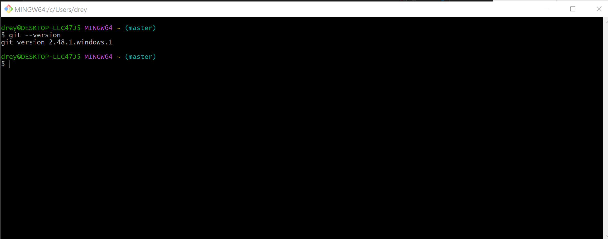
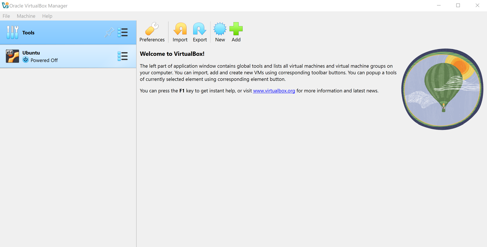
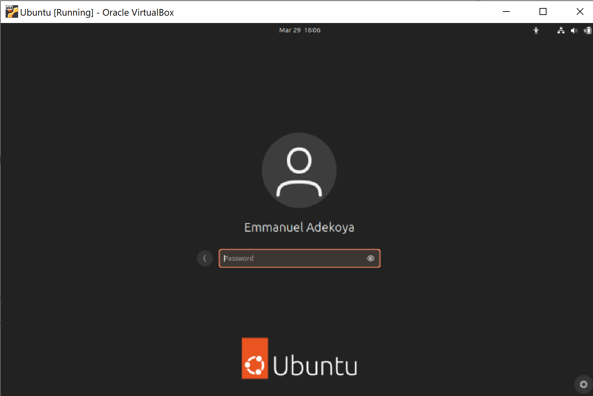

# EMMANUEL ADEKOYA DevOps COHORT3

## Visual Studio Code Download and Set Up: 

- _**Enter**_ the url  **[visual studio](code.visualstudio.com)** in your browser address bar to navigate to the Visual Studio website
- _**Click**_ download and select appropriate download that supports your computer and operating system specification.
- _**Start**_ the installer and follow the instructions to complete download.
- _**Launch**_ the app.

## Git Download and Set Up: 

- _**Enter**_ the url **[download git](git-scm.com)** in your browser address bar to navigate to the git website
- _**Click**_ download and select appropriate download that supports your computer and operating system specification.
- _**Start**_ the installer and follow the instructions to complete download.
- _**Launch**_ the app.
- _**Type**_ the command 

## Oracle Virtual Box Download and Set Up:

- _**Enter**_ the url **[Oracle virtual Box](virtualbox.org)** in your browser address bar to navigate to the git website
- _**Click**_ download and select appropriate download that supports your computer and operating system specification.
- _**Start**_ the installer and follow the instructions to complete download.
- _**Launch**_ the app.

## Ubuntu Download and Set Up: 

- _**Enter**_ the url **[ubuntu](ubuntu.com)** in your browser address bar to navigate to the git website
- _**Click**_ download and select appropriate download that supports your computer and operating system specification.
- _**Start**_ by launching your already installed virtualbox application.
- _**Create**_ a new Virtual Machine by clicking the Addition sign at the top of the app.
- _**Configure**_ the VM through a series of steps: dynamically choosing RAM size, at least 2GB. Also dynamically defining hard disk capacity and processor.
- _**Select**_ installation file so that the installer knows what location to find the file to be installed.
- _**Start**_ the VM after selecting Ubuntu and watch the installation process begin.
- _**Install**_ Ubuntu properly in the new Window to configure mouse, language, and keyboard. Then register an account as user.
- _**Wait**_ for the installation to complete, which may take some time, then you will be prompted to restart. Close apps and restart system.
- _**Launch**_ by powering on virtual box and start Ubuntu VM, but this time it loads your Ubuntu OS without further delays with your registered profile. Then, you may login with your registered credentials as seen below.

# Creating Github and AWS Accounts

## Github Account Sign Up and Sign In: 

- _**Enter**_ the url **[github](github.com)** in your browser address bar to navigate to the git website
- _**Click**_ Sign Up after filling your email and proceed with other information and verification through the link sent to your email.
- _**Sign in**_ to your account with your user credentials and you should have a view similar to below:

## AWS Account Sign Up and Sign In:

- _**Console/ Account view**_ has a similar view like above.
- _**Enter**_ the url **[AWS-amazon](aws.amazon.com)** in your browser address bar to navigate to the git website
- _**Click**_ Sign Up and fill your information, such as email, password other information and verification through the link sent to your email.
- _**Provide**_ card information of your dollar account to make payment which is refundable for Free support plan.
- _**Verify**_ your identity and choose a support plan.
- _**Wait**_ for an approval notification after which you can have full access to aws services.
- _**Select**_ Root User to sign as a root user.
- _**Sign in**_ to your account with your user credentials and select _Root User_ you should have a view similar to below while signing in:

