# EMMANUEL ADEKOYA DevOps COHORT3

## Visual Studio Download : **code.visualstudio.com**

- _**Enter**_ the url  above in your browser address bar to navigate to the Visual Studio website
- _**Click**_ download and select appropriate download that supports your computer and operating system specification.

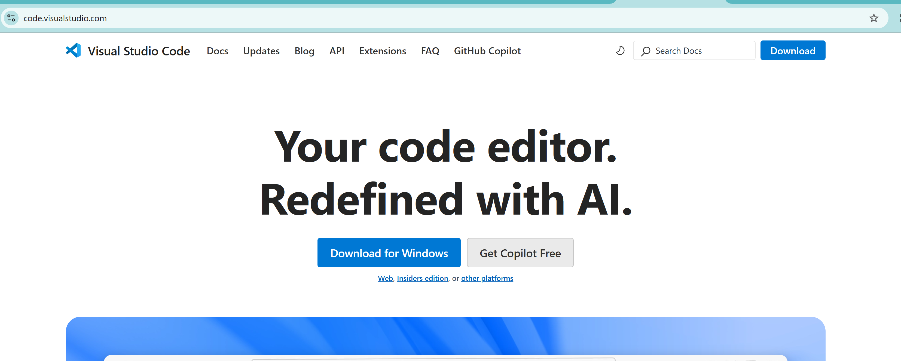

## After Download

- _**Start**_ the installer and follow the instructions to complete download.
- _**Launch**_ the app to see the image below.

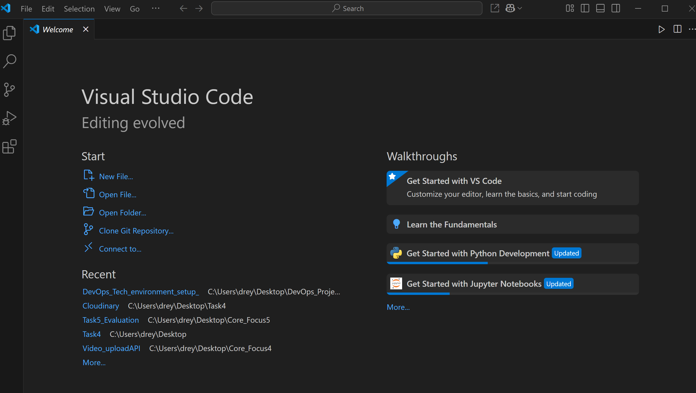

## Git Download : **git-scm.com**

- _**Enter**_ the url  above in your browser address bar to navigate to the git website
- _**Click**_ download and select appropriate download that supports your computer and operating system specification.

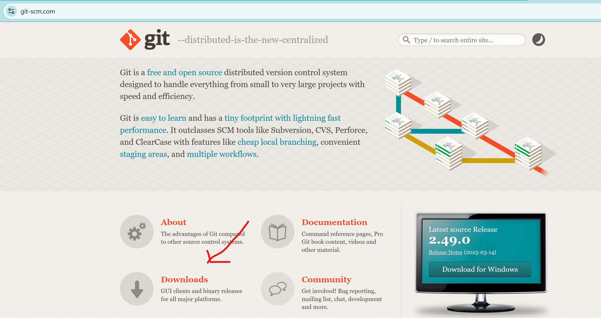

## After Download

- _**Start**_ the installer and follow the instructions to complete download.
- _**Launch**_ the app to see the image below.

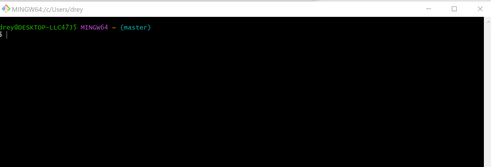

## Virtualbox Download : **virtualbox.org**

- _**Enter**_ the url  above in your browser address bar to navigate to the git website
- _**Click**_ download and select appropriate download that supports your computer and operating system specification.

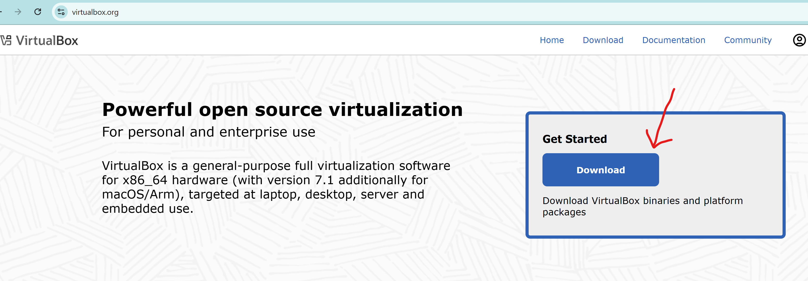

## After Download

- _**Start**_ the installer and follow the instructions to complete download.
- _**Launch**_ the app to see the image below.

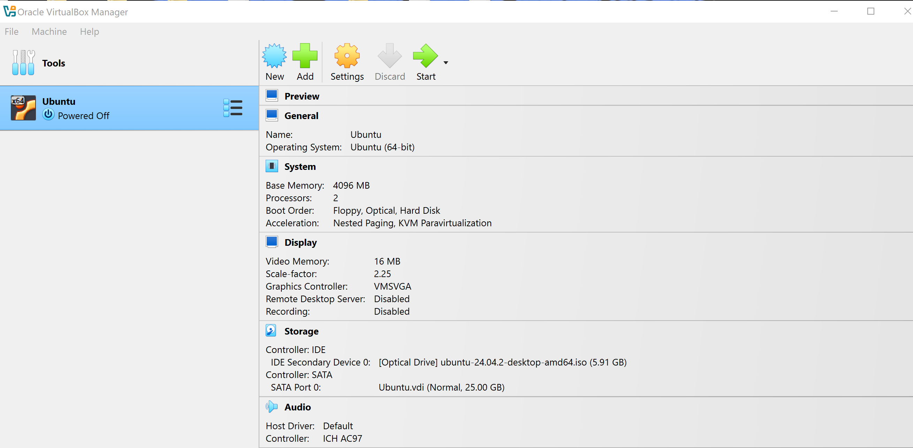

## Ubuntu Download : **ubuntu.com**

- _**Enter**_ the url  above in your browser address bar to navigate to the git website
- _**Click**_ download and select appropriate download that supports your computer and operating system specification.

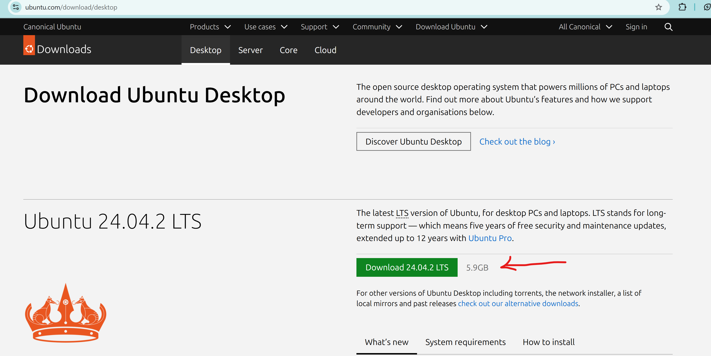

## After Download

- _**Start**_ by launching your already installed virtualbox application.
- _**Create**_ a new Virtual Machine by clicking the Addition sign at the top of the app.
- _**Configure**_ the VM through a series of steps: dynamically choosing RAM size, at least 2GB. Also dynamically defining hard disk capacity and processor.
- _**Select**_ installation file so that the installer knows what location to find the file to be installed.
- _**Start**_ the VM after selecting Ubuntu and watch the installation process begin.
- _**Install**_ Ubuntu properly in the new Window to configure mouse, language, and keyboard. Then register an account as user.
- _**Launch**_ by powering off virtual box and log in to your Ubuntu with your registered credentials as seen below.

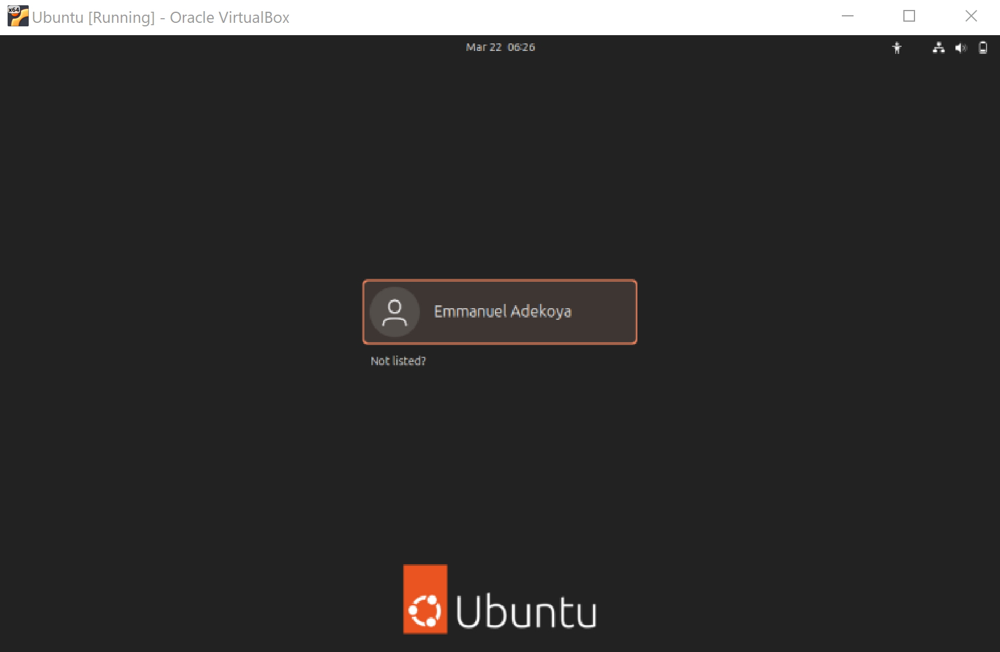

# Creating Github and AWS Accounts

## Github Account Sign Up: **github.com**

- _**Enter**_ the url  above in your browser address bar to navigate to the git website
- _**Click**_ Sign Up after filling your email and proceed with other information and verification through the link sent to your email.

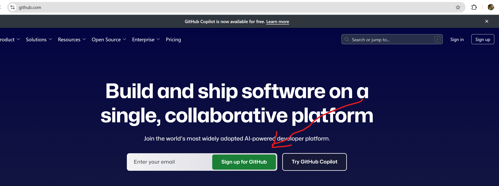

## After Sign Up

- _**Sign in**_ to your account with your user credentials and you should have a view similar to below:

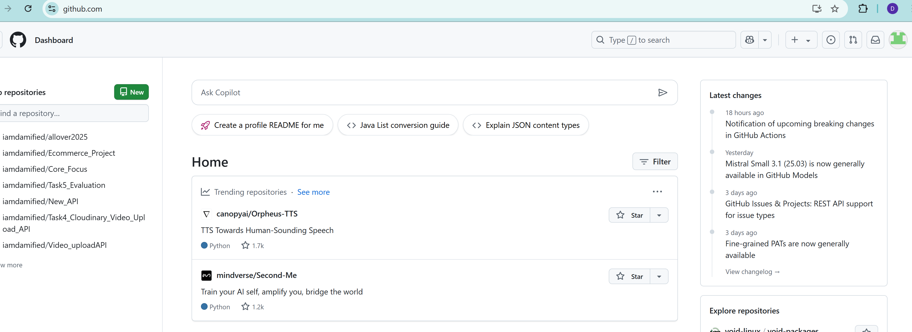

## AWS Account Sign Up: ** aws.amazon.com**

- _**Enter**_ the url  above in your browser address bar to navigate to the git website
- _**Click**_ Sign Up and fill your information, such as email, password other information and verification through the link sent to your email.
- _**Provide**_ card information of your dollar account to make payment which is refundable for Free support plan.
- _**Verify**_ your identity and choose a support plan.
- _**Wait**_ for an approval notification after which you can have full access to aws services.
- _**Click**_

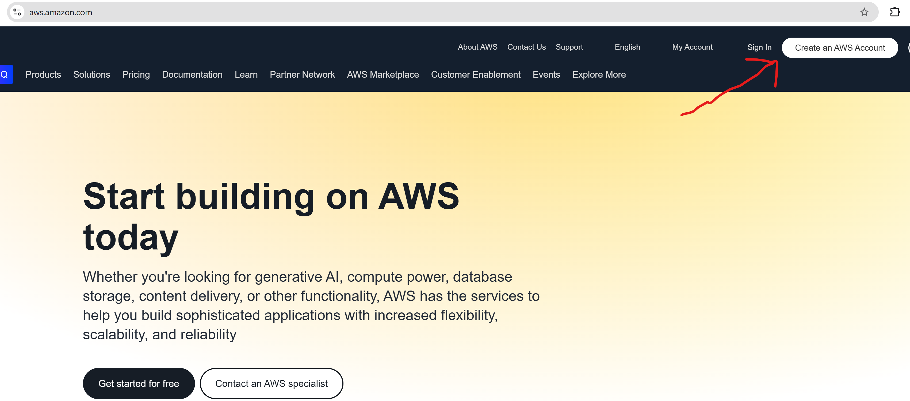

## After Sign Up

- _**Sign in**_ to your account with your user credentials and select _Root User_ you should have a view similar to below:

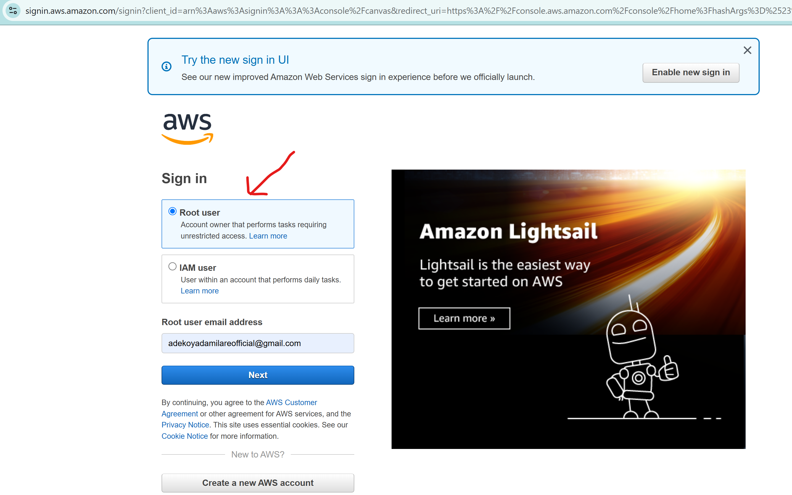

## After Sign In

- _**Console/ Account view**_ has a similar view like below:

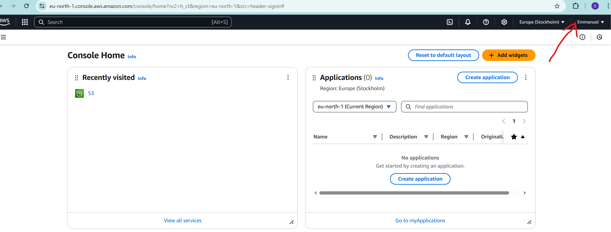