# Mini Project: Git Version Control Basics

- ## Description
This is a mini project to show how version control system works in managing projects and integrating files. In this Project, both Tom and Jerry worked on the same project from their separate branches simultaneously, and then push to main branch.

- ## Github Project 

Main Repo to be cloned:  _**git clone "project-url"**_

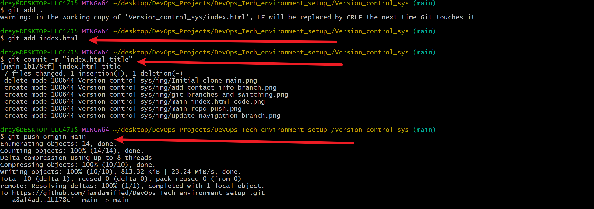

- ## Index HTML file Project

VSCODE view of index.html project: _**code index.html**_

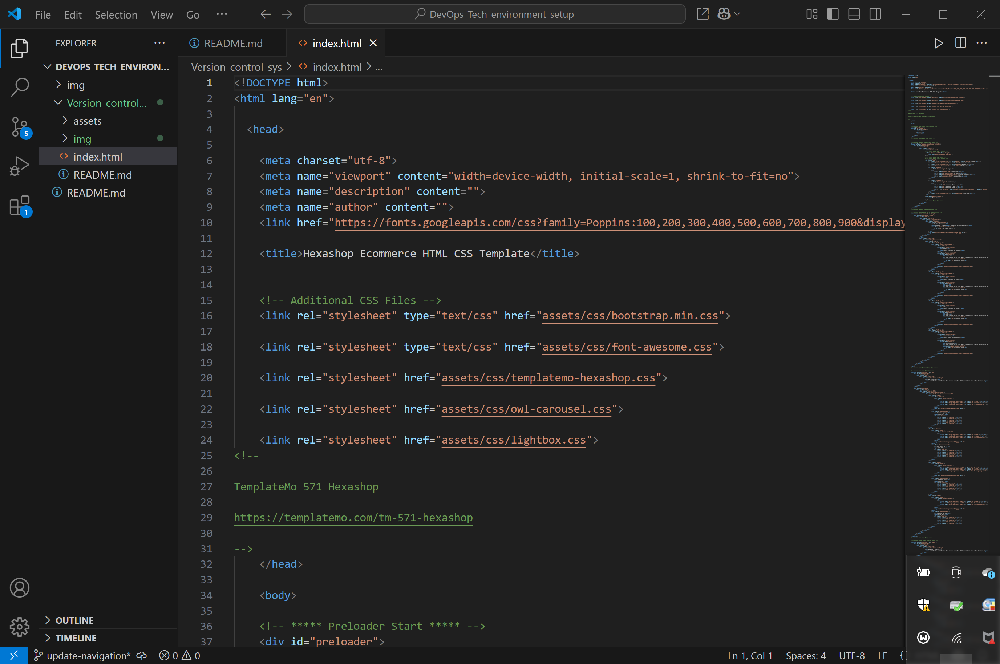

- ## Files Present in Repo

Git command to view all files present in repo: _**ls  or  ls -al**_

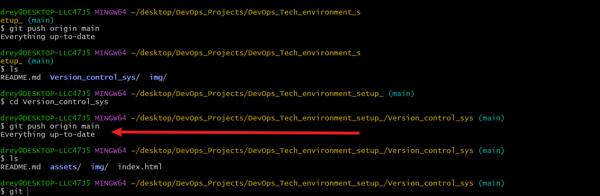

- ## File Staging, Commiting to Local Repo and Push to Remote Repo

Staging command: _**git add index.html**_

Commit command: _**git commit -m "contact information"**_

Push command: _**git push origin main**_

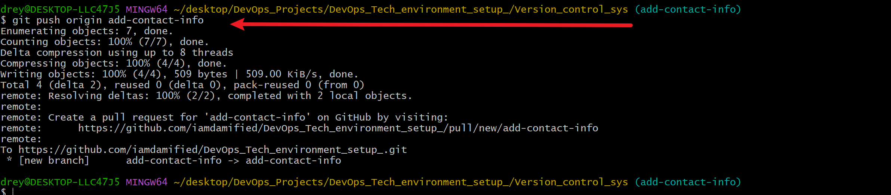

- ## File staging status

Status command: _**git status**_

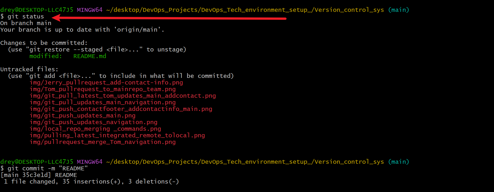

- ## Created the add-contact-info branch and switching

Command: _**git checkout -b add-contact-info**_

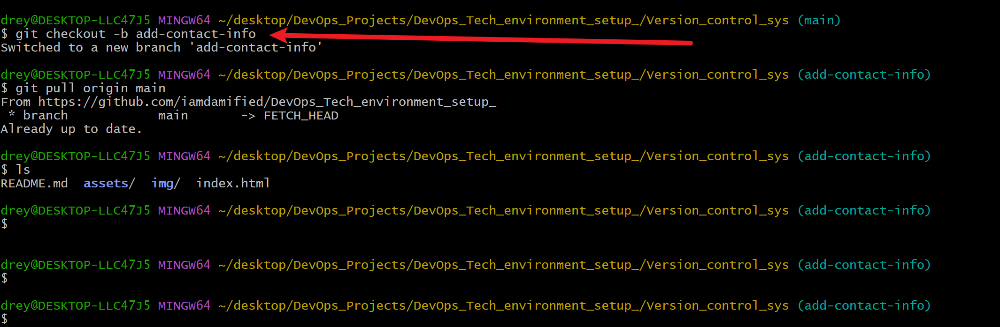

- ## Created the update-navigation branch and switching and view branches

Create update-navigation Command: _**git checkout -b update-navigation**_

Show branches Command: _**git branch**_

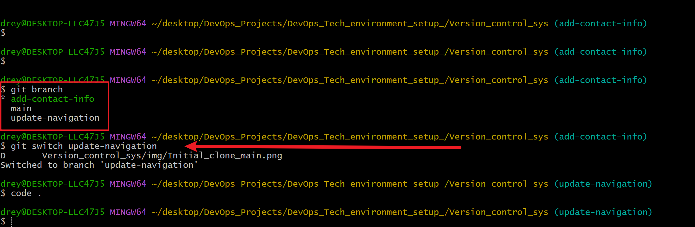

- ## Pulled changes from main branch to update-navigation branch

Pull Command: _**git pull origin main**_

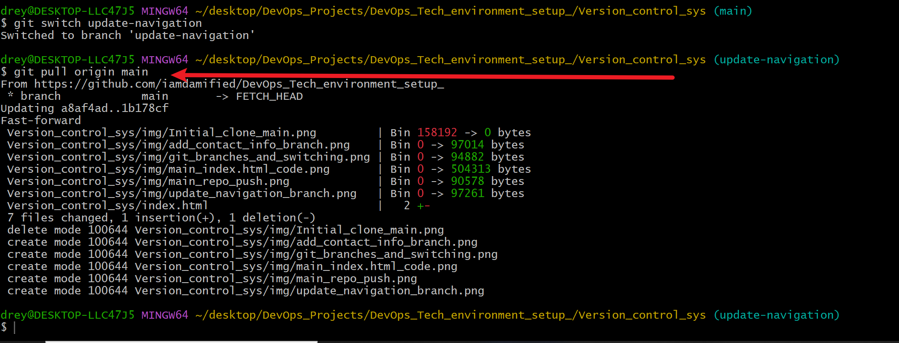

- ## Pushed changes from update-navigation branch to main branch

Staging Command: _**git add .**_

Commiting Command: _**git commit -m "change in navigation bar"**_

Push Command: _**git push origin main**_

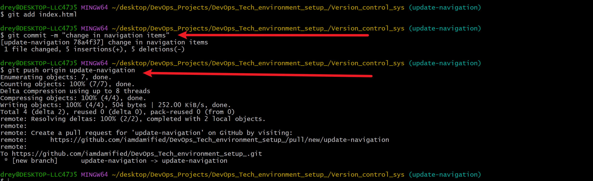

- ## Switched to add-contact-info branch to apply changes

Switch Command: _**git switch add-contact-info**_

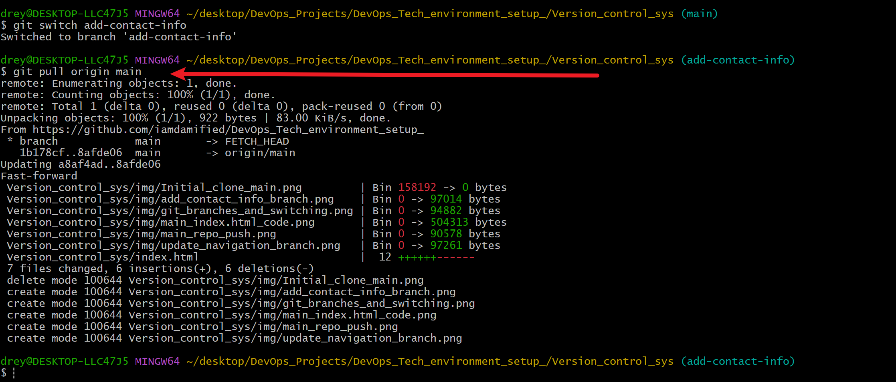

- ## Pushed changes in add-contact-info branch to repository

Switch Command: _**git push origin add-contact-info**_

- ## Created Pull request on the Github main repository

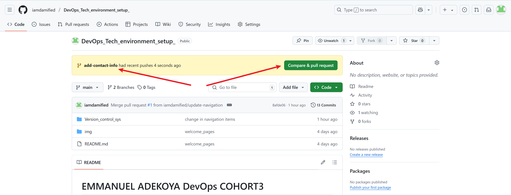

- ## Merging request on the Github main repository

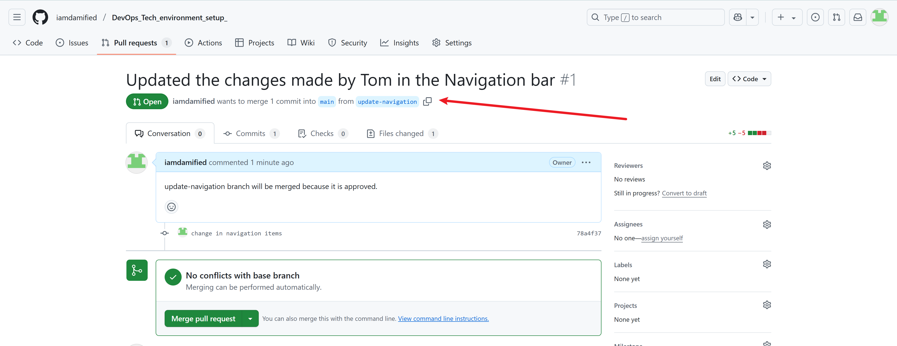

- ## Merged the branch branches to the main in the local repository

Merge Branch Command: _**git merge add-contact-info**_

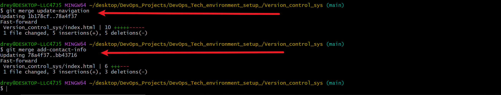

- ## Final push from local main repo to remote main repo

Command: _**git push origin main**_

